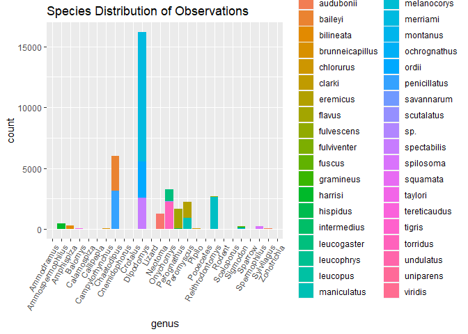
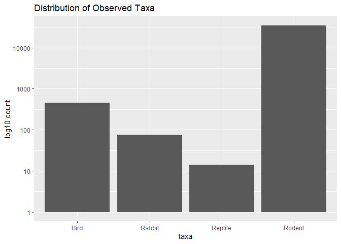
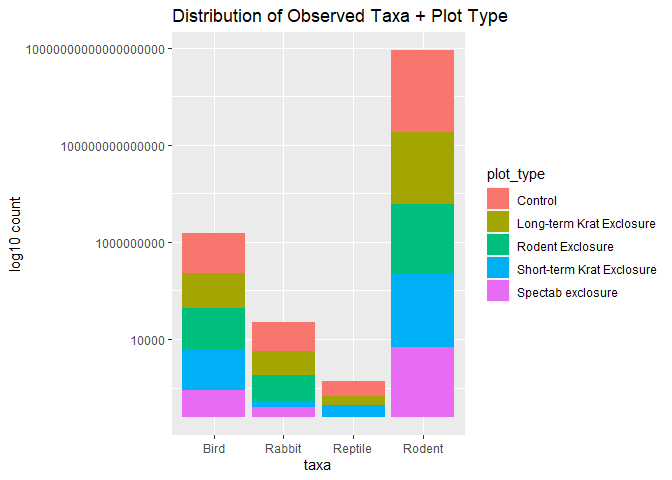
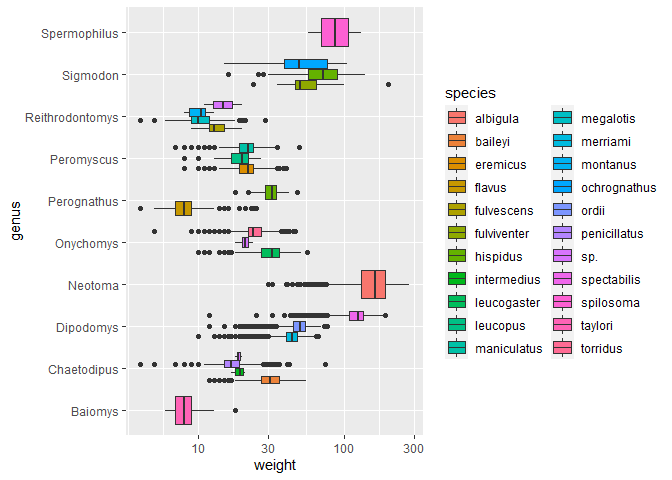
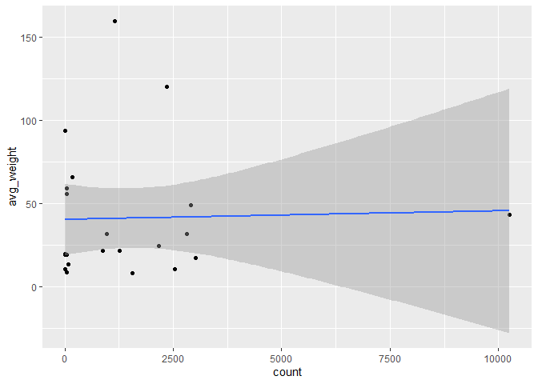
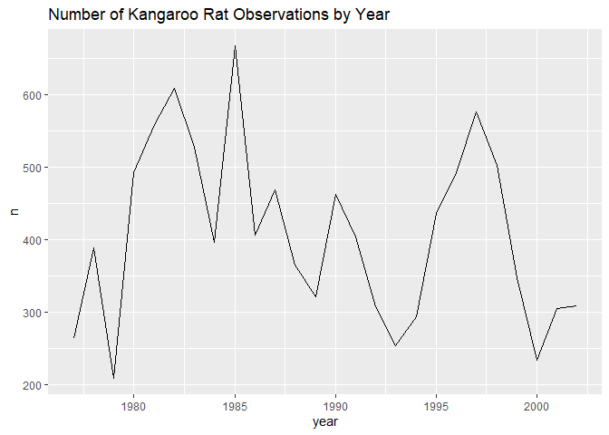
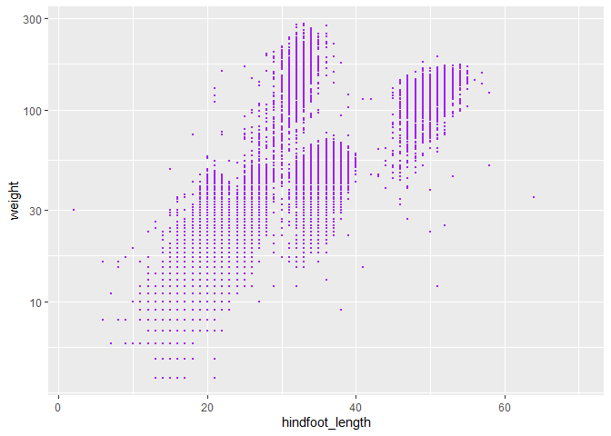
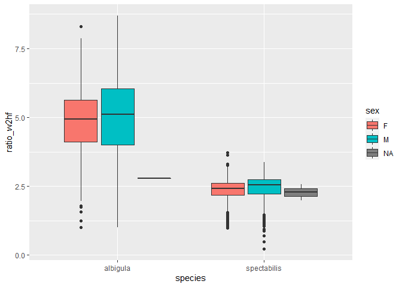
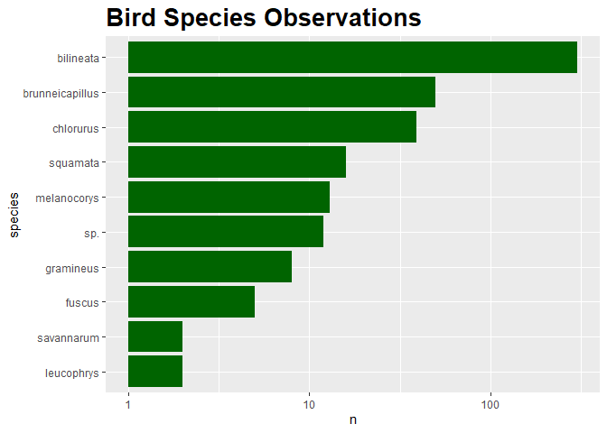

## Instructions
Answer the following questions and complete the exercises in RMarkdown. Please embed all of your code and push your final work to your repository. Your final lab report should be organized, clean, and run free from errors. Remember, you must remove the `#` for the included code chunks to run. Be sure to add your name to the author header above. For any included plots, make sure they are clearly labeled. You are free to use any plot type that you feel best communicates the results of your analysis.  

Make sure to use the formatting conventions of RMarkdown to make your report neat and clean!  

## Load the libraries

```r
library(tidyverse)
library(janitor)
library(here)
library(naniar)
```

## Desert Ecology
For this assignment, we are going to use a modified data set on [desert ecology](http://esapubs.org/archive/ecol/E090/118/). The data are from: S. K. Morgan Ernest, Thomas J. Valone, and James H. Brown. 2009. Long-term monitoring and experimental manipulation of a Chihuahuan Desert ecosystem near Portal, Arizona, USA. Ecology 90:1708.

```r
deserts <- read_csv("data/surveys_complete.csv")
```

```
## Rows: 34786 Columns: 13
## -- Column specification --------------------------------------------------------
## Delimiter: ","
## chr (6): species_id, sex, genus, species, taxa, plot_type
## dbl (7): record_id, month, day, year, plot_id, hindfoot_length, weight
## 
## i Use `spec()` to retrieve the full column specification for this data.
## i Specify the column types or set `show_col_types = FALSE` to quiet this message.
```

```r
options(scipen=999) #cancels the use of scientific notation for the session
```


1. Use the function(s) of your choice to get an idea of its structure, including how NA's are treated. Are the data tidy?  


```r
names(deserts)
```

```
##  [1] "record_id"       "month"           "day"             "year"           
##  [5] "plot_id"         "species_id"      "sex"             "hindfoot_length"
##  [9] "weight"          "genus"           "species"         "taxa"           
## [13] "plot_type"
```


```r
summary(deserts)
```

```
##    record_id         month             day            year         plot_id     
##  Min.   :    1   Min.   : 1.000   Min.   : 1.0   Min.   :1977   Min.   : 1.00  
##  1st Qu.: 8964   1st Qu.: 4.000   1st Qu.: 9.0   1st Qu.:1984   1st Qu.: 5.00  
##  Median :17762   Median : 6.000   Median :16.0   Median :1990   Median :11.00  
##  Mean   :17804   Mean   : 6.474   Mean   :16.1   Mean   :1990   Mean   :11.34  
##  3rd Qu.:26655   3rd Qu.:10.000   3rd Qu.:23.0   3rd Qu.:1997   3rd Qu.:17.00  
##  Max.   :35548   Max.   :12.000   Max.   :31.0   Max.   :2002   Max.   :24.00  
##                                                                                
##   species_id            sex            hindfoot_length     weight      
##  Length:34786       Length:34786       Min.   : 2.00   Min.   :  4.00  
##  Class :character   Class :character   1st Qu.:21.00   1st Qu.: 20.00  
##  Mode  :character   Mode  :character   Median :32.00   Median : 37.00  
##                                        Mean   :29.29   Mean   : 42.67  
##                                        3rd Qu.:36.00   3rd Qu.: 48.00  
##                                        Max.   :70.00   Max.   :280.00  
##                                        NA's   :3348    NA's   :2503    
##     genus             species              taxa            plot_type        
##  Length:34786       Length:34786       Length:34786       Length:34786      
##  Class :character   Class :character   Class :character   Class :character  
##  Mode  :character   Mode  :character   Mode  :character   Mode  :character  
##                                                                             
##                                                                             
##                                                                             
## 
```

```r
miss_var_summary(deserts)
```

```
## # A tibble: 13 x 3
##    variable        n_miss pct_miss
##    <chr>            <int>    <dbl>
##  1 hindfoot_length   3348     9.62
##  2 weight            2503     7.20
##  3 sex               1748     5.03
##  4 record_id            0     0   
##  5 month                0     0   
##  6 day                  0     0   
##  7 year                 0     0   
##  8 plot_id              0     0   
##  9 species_id           0     0   
## 10 genus                0     0   
## 11 species              0     0   
## 12 taxa                 0     0   
## 13 plot_type            0     0
```

2. How many genera and species are represented in the data? What are the total number of observations? Which species is most/ least frequently sampled in the study?

- Total Genera and Species represented in the data:

```r
deserts %>% 
  summarize(represented_genera=n_distinct(genus),
            represented_species=n_distinct(species))
```

```
## # A tibble: 1 x 2
##   represented_genera represented_species
##                <int>               <int>
## 1                 26                  40
```
    - there are 26 genera and 40 different species represented in the data.
    
- Total number observations in the data:

```r
deserts %>% summarize(total_obs=n())
```

```
## # A tibble: 1 x 1
##   total_obs
##       <int>
## 1     34786
```

- Distribution of species observed:

```r
deserts %>% 
  ggplot(aes(x=genus, fill=species))+
  geom_bar()+
  labs(title = "Species Distribution of Observations")+
  theme(axis.text.x = element_text(angle = 60, hjust = 1))
```

<!-- -->


```r
deserts %>% 
  count(genus,species) %>% 
  filter(n==1)
```

```
## # A tibble: 6 x 3
##   genus         species          n
##   <chr>         <chr>        <int>
## 1 Cnemidophorus tigris           1
## 2 Cnemidophorus uniparens        1
## 3 Crotalus      scutalatus       1
## 4 Crotalus      viridis          1
## 5 Sceloporus    clarki           1
## 6 Spermophilus  tereticaudus     1
```
    -These species have only 1 observation in the dataset
    

```r
deserts %>% 
  count(genus,species) %>% 
  arrange(desc(n)) %>% 
  head(n=1)
```

```
## # A tibble: 1 x 3
##   genus     species      n
##   <chr>     <chr>    <int>
## 1 Dipodomys merriami 10596
```
    -*D. merriami* has the highest number of observations in the data at 10,596.

3. What is the proportion of taxa included in this study? Show a table and plot that reflects this count.


```r
deserts %>% 
  ggplot(aes(x=taxa))+
  geom_bar()+
  scale_y_log10()+
  labs(title="Distribution of Observed Taxa",
       x="taxa",
       y="log10 count")
```

<!-- -->


```r
deserts %>% 
  count(taxa)
```

```
## # A tibble: 4 x 2
##   taxa        n
##   <chr>   <int>
## 1 Bird      450
## 2 Rabbit     75
## 3 Reptile    14
## 4 Rodent  34247
```
- The majority of observations are of the Rodent taxa

4. For the taxa included in the study, use the fill option to show the proportion of individuals sampled by `plot_type.`


```r
deserts %>% 
  ggplot(aes(x=taxa, fill=plot_type))+
  geom_bar()+
  scale_y_log10()+
  labs(title="Distribution of Observed Taxa + Plot Type",
       x="taxa",
       y="log10 count")
```

<!-- -->


5. What is the range of weight for each species included in the study? Remove any observations of weight that are NA so they do not show up in the plot.


```r
deserts %>% 
  filter(weight!="NA") %>% 
  ggplot(aes(x=genus, fill=species, y=weight))+
  geom_boxplot()+
  coord_flip()+
  scale_y_log10()
```

<!-- -->


6. Add another layer to your answer from #4 using `geom_point` to get an idea of how many measurements were taken for each species.


```r
##I can't do a scatter plot with measurements for each species because there is categorical data, scatter plots are for 2 continuous variables
#I can do a scatterplot for counts and average weights instead?

idek <- deserts %>% 
  filter(weight!="NA") %>% 
  group_by(species) %>% 
  summarize(avg_weight=mean(weight), count=n()) %>% 
  print()
```

```
## # A tibble: 22 x 3
##    species     avg_weight count
##    <chr>            <dbl> <int>
##  1 albigula        159.    1152
##  2 baileyi          31.7   2810
##  3 eremicus         21.6   1260
##  4 flavus            7.92  1548
##  5 fulvescens       13.4     75
##  6 fulviventer      58.9     41
##  7 hispidus         65.6    172
##  8 intermedius      19.2      8
##  9 leucogaster      31.6    970
## 10 leucopus         19.1     36
## # ... with 12 more rows
```


```r
idek %>% 
  ggplot(aes(x=count, y=avg_weight)) +
  geom_point()+geom_smooth(method=lm)
```

```
## `geom_smooth()` using formula 'y ~ x'
```

<!-- -->


7. [Dipodomys merriami](https://en.wikipedia.org/wiki/Merriam's_kangaroo_rat) is the most frequently sampled animal in the study. How have the number of observations of this species changed over the years included in the study?


```r
kangarodent_count <- deserts %>% 
  filter(species=="merriami") %>% 
  count(year)
```


```r
kangarodent_count %>% 
  ggplot(aes(x=year, y=n))+geom_line()+
  labs(title = "Number of Kangaroo Rat Observations by Year")
```

<!-- -->

8. What is the relationship between `weight` and `hindfoot` length? Consider whether or not over plotting is an issue.


```r
deserts %>% 
  ggplot(aes(x=hindfoot_length, y=weight))+
  geom_point(color="purple", size=0.5, na.rm=T)+ #overplotting is kind of an issue\
  scale_y_log10()
```

<!-- -->


9. Which two species have, on average, the highest weight? Once you have identified them, make a new column that is a ratio of `weight` to `hindfoot_length`. Make a plot that shows the range of this new ratio and fill by sex.


```r
deserts %>% 
  group_by(species) %>% 
  summarize(mean_weight=mean(weight, na.rm=T)) %>% 
  arrange(desc(mean_weight)) %>% 
  head(n=2)%>%
  print()
```

```
## # A tibble: 2 x 2
##   species     mean_weight
##   <chr>             <dbl>
## 1 albigula           159.
## 2 spectabilis        120.
```


```r
weight_hindfoot_ratio <- deserts %>% 
  mutate(ratio_w2hf=weight/hindfoot_length)
```


```r
weight_hindfoot_ratio %>% 
  filter(species=="albigula"| species=="spectabilis") %>% 
  ggplot(aes(x=species, fill=sex, y=ratio_w2hf))+
  geom_boxplot(na.rm=T)
```

<!-- -->

10. Make one plot of your choice! Make sure to include at least two of the aesthetics options you have learned.

- I want to look at the distribution of bird species observed in the desert

```r
desert_birds <- deserts %>% 
  filter(taxa=="Bird") %>% 
  count(species)
```


```r
desert_birds %>% 
  ggplot(aes(x=reorder(species, n), y=n))+
  geom_col(fill = "darkgreen")+
  scale_y_log10()+
  coord_flip()+
  labs(title="Bird Species Observations",
       x="species",
       y="n")+
  theme(plot.title=element_text(size=20, face="bold"))
```

<!-- -->

The most commonly observed bird in the desert is *A.bilineata*, which is the black throated sparrow.

## Push your final code to GitHub!
Please be sure that you check the `keep md` file in the knit preferences. 
