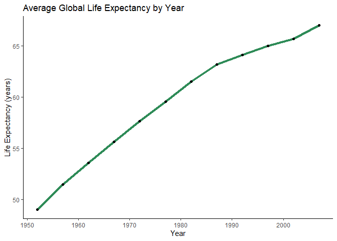
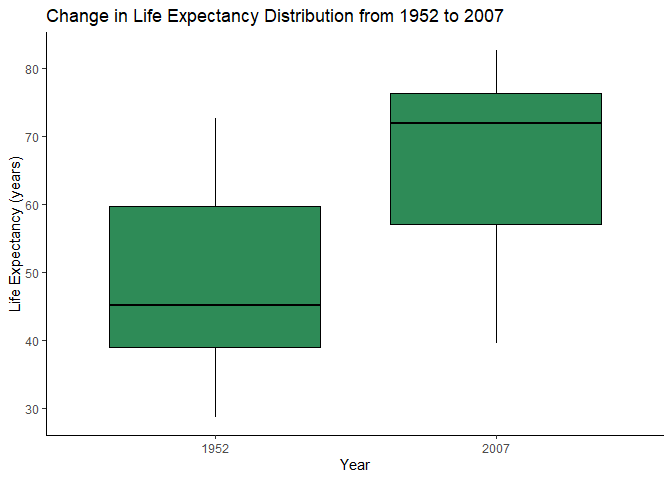
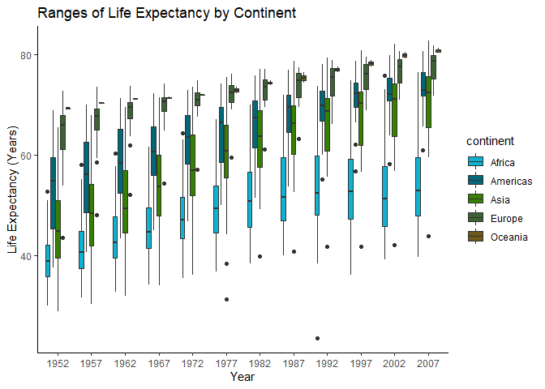
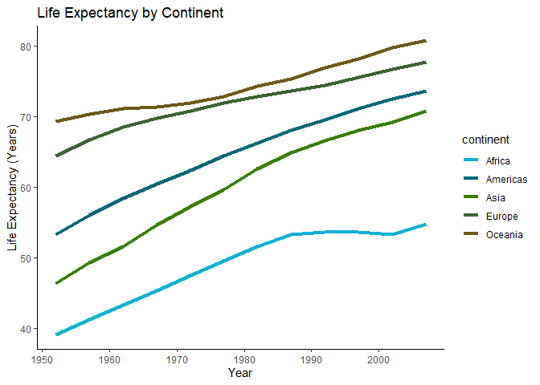
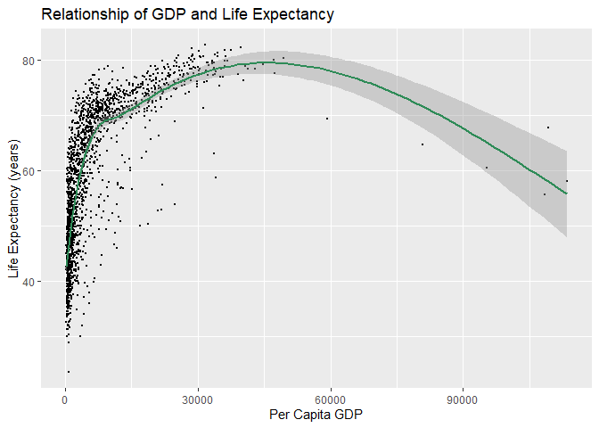
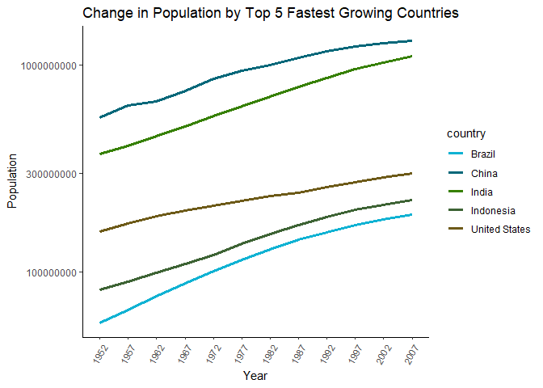
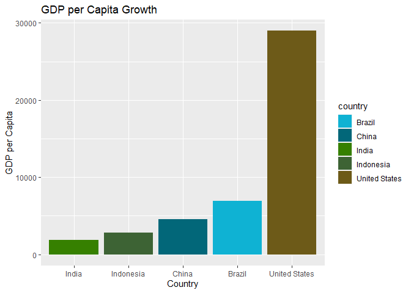
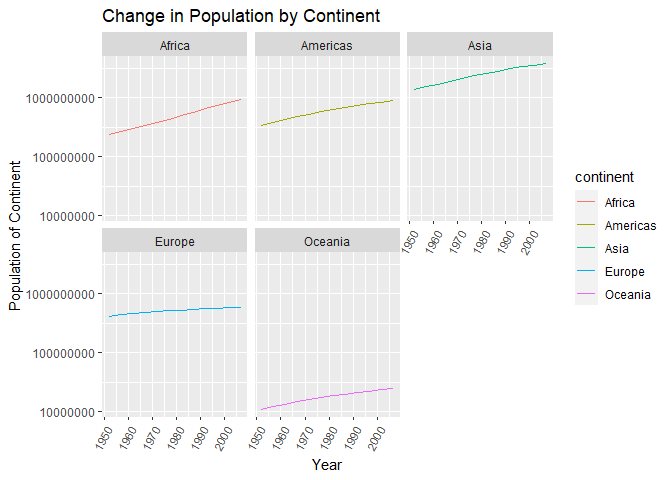

## Instructions
Answer the following questions and complete the exercises in RMarkdown. Please embed all of your code and push your final work to your repository. Your final lab report should be organized, clean, and run free from errors. Remember, you must remove the `#` for the included code chunks to run. Be sure to add your name to the author header above. For any included plots, make sure they are clearly labeled. You are free to use any plot type that you feel best communicates the results of your analysis.  

**In this homework, you should make use of the aesthetics you have learned. It's OK to be flashy!**

Make sure to use the formatting conventions of RMarkdown to make your report neat and clean!  

## Load the libraries

```r
library(tidyverse)
library(janitor)
library(here)
library(naniar)
library(ggthemes)
```

```r
options(scipen=999) #cancels the use of scientific notation for the session
```

## Resources
The idea for this assignment came from [Rebecca Barter's](http://www.rebeccabarter.com/blog/2017-11-17-ggplot2_tutorial/) ggplot tutorial so if you get stuck this is a good place to have a look.  

## Gapminder
For this assignment, we are going to use the dataset [gapminder](https://cran.r-project.org/web/packages/gapminder/index.html). Gapminder includes information about economics, population, and life expectancy from countries all over the world. You will need to install it before use. This is the same data that we will use for midterm 2 so this is good practice.

```r
#install.packages("gapminder")
library("gapminder")
```

## Questions
The questions below are open-ended and have many possible solutions. Your approach should, where appropriate, include numerical summaries and visuals. Be creative; assume you are building an analysis that you would ultimately present to an audience of stakeholders. Feel free to try out different `geoms` if they more clearly present your results.  

**1. Use the function(s) of your choice to get an idea of the overall structure of the data frame, including its dimensions, column names, variable classes, etc. As part of this, determine how NA's are treated in the data.**  


```r
summary(gapminder)
```

```
##         country        continent        year         lifeExp     
##  Afghanistan:  12   Africa  :624   Min.   :1952   Min.   :23.60  
##  Albania    :  12   Americas:300   1st Qu.:1966   1st Qu.:48.20  
##  Algeria    :  12   Asia    :396   Median :1980   Median :60.71  
##  Angola     :  12   Europe  :360   Mean   :1980   Mean   :59.47  
##  Argentina  :  12   Oceania : 24   3rd Qu.:1993   3rd Qu.:70.85  
##  Australia  :  12                  Max.   :2007   Max.   :82.60  
##  (Other)    :1632                                                
##       pop               gdpPercap       
##  Min.   :     60011   Min.   :   241.2  
##  1st Qu.:   2793664   1st Qu.:  1202.1  
##  Median :   7023596   Median :  3531.8  
##  Mean   :  29601212   Mean   :  7215.3  
##  3rd Qu.:  19585222   3rd Qu.:  9325.5  
##  Max.   :1318683096   Max.   :113523.1  
## 
```

```r
skimr::skim(gapminder)
```


Table: Data summary

|                         |          |
|:------------------------|:---------|
|Name                     |gapminder |
|Number of rows           |1704      |
|Number of columns        |6         |
|_______________________  |          |
|Column type frequency:   |          |
|factor                   |2         |
|numeric                  |4         |
|________________________ |          |
|Group variables          |None      |


**Variable type: factor**

|skim_variable | n_missing| complete_rate|ordered | n_unique|top_counts                             |
|:-------------|---------:|-------------:|:-------|--------:|:--------------------------------------|
|country       |         0|             1|FALSE   |      142|Afg: 12, Alb: 12, Alg: 12, Ang: 12     |
|continent     |         0|             1|FALSE   |        5|Afr: 624, Asi: 396, Eur: 360, Ame: 300 |


**Variable type: numeric**

|skim_variable | n_missing| complete_rate|        mean|           sd|       p0|        p25|        p50|         p75|         p100|hist                                     |
|:-------------|---------:|-------------:|-----------:|------------:|--------:|----------:|----------:|-----------:|------------:|:----------------------------------------|
|year          |         0|             1|     1979.50|        17.27|  1952.00|    1965.75|    1979.50|     1993.25|       2007.0|▇▅▅▅▇ |
|lifeExp       |         0|             1|       59.47|        12.92|    23.60|      48.20|      60.71|       70.85|         82.6|▁▆▇▇▇ |
|pop           |         0|             1| 29601212.32| 106157896.74| 60011.00| 2793664.00| 7023595.50| 19585221.75| 1318683096.0|▇▁▁▁▁ |
|gdpPercap     |         0|             1|     7215.33|      9857.45|   241.17|    1202.06|    3531.85|     9325.46|     113523.1|▇▁▁▁▁ |

```r
gap_clean <- janitor::clean_names(gapminder)
```


```r
names(gap_clean)
```

```
## [1] "country"    "continent"  "year"       "life_exp"   "pop"       
## [6] "gdp_percap"
```


**2. Among the interesting variables in gapminder is life expectancy. How has global life expectancy changed between 1952 and 2007?**


```r
global_life_exp <- gap_clean %>% 
  group_by(year) %>% 
  summarize(avg_global_life_exp=mean(life_exp)) %>% 
  print()
```

```
## # A tibble: 12 x 2
##     year avg_global_life_exp
##    <int>               <dbl>
##  1  1952                49.1
##  2  1957                51.5
##  3  1962                53.6
##  4  1967                55.7
##  5  1972                57.6
##  6  1977                59.6
##  7  1982                61.5
##  8  1987                63.2
##  9  1992                64.2
## 10  1997                65.0
## 11  2002                65.7
## 12  2007                67.0
```

```r
global_life_exp %>% 
  ggplot(aes(x=year, y=avg_global_life_exp))+
  geom_line(color="seagreen", size=1.5)+
  geom_point()+
  labs(title="Average Global Life Expectancy by Year",
       x="Year",
       y="Life Expectancy (years)")+
  theme_classic()
```

<!-- -->

- Average life expectancy has increased globally from 1952 to 2007

**3. How do the distributions of life expectancy compare for the years 1952 and 2007?**


```r
gap_clean <- gap_clean %>% 
  mutate(factor_years=as.factor(gap_clean$year))
```


```r
gap_clean %>% 
  filter(year==1952|year==2007) %>% 
  ggplot(aes(x=factor_years, y=life_exp))+
  geom_boxplot(fill="seagreen", color="black")+
  theme_classic()+
  labs(title="Change in Life Expectancy Distribution from 1952 to 2007",
       x="Year",
       y="Life Expectancy (years)")
```

<!-- -->

**4. Your answer above doesn't tell the whole story since life expectancy varies by region. Make a summary that shows the min, mean, and max life expectancy by continent for all years represented in the data.**


```r
library(paletteer)
my_palette <- paletteer_d("calecopal::kelp2")
```


```r
gap_clean %>% 
  ggplot(aes(x=factor_years, y=life_exp, fill=continent))+
  geom_boxplot(bins=55)+
  scale_fill_manual(values=my_palette)+
  theme_classic()+
  labs(title="Ranges of Life Expectancy by Continent",
       x="Year",
       y="Life Expectancy (Years)")
```

```
## Warning: Ignoring unknown parameters: bins
```

<!-- -->


**5. How has life expectancy changed between 1952-2007 for each continent?**


```r
life_by_continent <- gap_clean %>% 
  group_by(continent, year) %>% 
  summarize(avg_life_exp=mean(life_exp)) %>% 
  print()
```

```
## `summarise()` has grouped output by 'continent'. You can override using the
## `.groups` argument.
```

```
## # A tibble: 60 x 3
## # Groups:   continent [5]
##    continent  year avg_life_exp
##    <fct>     <int>        <dbl>
##  1 Africa     1952         39.1
##  2 Africa     1957         41.3
##  3 Africa     1962         43.3
##  4 Africa     1967         45.3
##  5 Africa     1972         47.5
##  6 Africa     1977         49.6
##  7 Africa     1982         51.6
##  8 Africa     1987         53.3
##  9 Africa     1992         53.6
## 10 Africa     1997         53.6
## # ... with 50 more rows
```

```r
life_by_continent %>% 
  ggplot(aes(x=year, y=avg_life_exp, color=continent))+
  geom_line(size=1.5)+
  scale_color_manual(values=my_palette)+
  theme_classic()+
  labs(title="Life Expectancy by Continent",
       x="Year",
       y="Life Expectancy (Years)")
```

<!-- -->


**6. We are interested in the relationship between per capita GDP and life expectancy; i.e. does having more money help you live longer?**


```r
gap_clean %>% 
  ggplot(aes(x=gdp_percap, y=life_exp))+
  geom_point(size=0.5, position="jitter")+
  geom_smooth(color="seagreen")+
  labs(title="Relationship of GDP and Life Expectancy",
       x="Per Capita GDP",
       y="Life Expectancy (years)")
```

```
## `geom_smooth()` using method = 'gam' and formula 'y ~ s(x, bs = "cs")'
```

<!-- -->

- This scatterplot shows us that as GDP increases, so does life expectancy, but only to a certain point. 
    - At the left side of the graph we can see a sharp increase in life expectancy as GDP increases, but this smooths out and eventually starts decreasing as the per capita GDP increases.

**7. Which countries have had the largest population growth since 1952?**


```r
gap_clean_wide <- gap_clean %>% 
  select(year, pop, country) %>% 
  pivot_wider(names_from= "year",
              values_from = "pop")
gap_clean_wide
```

```
## # A tibble: 142 x 13
##    country `1952` `1957` `1962` `1967` `1972` `1977` `1982` `1987` `1992` `1997`
##    <fct>    <int>  <int>  <int>  <int>  <int>  <int>  <int>  <int>  <int>  <int>
##  1 Afghan~ 8.43e6 9.24e6 1.03e7 1.15e7 1.31e7 1.49e7 1.29e7 1.39e7 1.63e7 2.22e7
##  2 Albania 1.28e6 1.48e6 1.73e6 1.98e6 2.26e6 2.51e6 2.78e6 3.08e6 3.33e6 3.43e6
##  3 Algeria 9.28e6 1.03e7 1.10e7 1.28e7 1.48e7 1.72e7 2.00e7 2.33e7 2.63e7 2.91e7
##  4 Angola  4.23e6 4.56e6 4.83e6 5.25e6 5.89e6 6.16e6 7.02e6 7.87e6 8.74e6 9.88e6
##  5 Argent~ 1.79e7 1.96e7 2.13e7 2.29e7 2.48e7 2.70e7 2.93e7 3.16e7 3.40e7 3.62e7
##  6 Austra~ 8.69e6 9.71e6 1.08e7 1.19e7 1.32e7 1.41e7 1.52e7 1.63e7 1.75e7 1.86e7
##  7 Austria 6.93e6 6.97e6 7.13e6 7.38e6 7.54e6 7.57e6 7.57e6 7.58e6 7.91e6 8.07e6
##  8 Bahrain 1.20e5 1.39e5 1.72e5 2.02e5 2.31e5 2.97e5 3.78e5 4.55e5 5.29e5 5.99e5
##  9 Bangla~ 4.69e7 5.14e7 5.68e7 6.28e7 7.08e7 8.04e7 9.31e7 1.04e8 1.14e8 1.23e8
## 10 Belgium 8.73e6 8.99e6 9.22e6 9.56e6 9.71e6 9.82e6 9.86e6 9.87e6 1.00e7 1.02e7
## # ... with 132 more rows, and 2 more variables: `2002` <int>, `2007` <int>
```

```r
this_object_almost_killed_me <- gap_clean_wide %>% 
  mutate(pop_growth=`2007`-`1952`)
```


```r
top_five <- this_object_almost_killed_me %>% 
  arrange(desc(pop_growth)) %>% 
  head(n=5) %>% 
  print()
```

```
## # A tibble: 5 x 14
##   country  `1952` `1957` `1962` `1967` `1972` `1977` `1982` `1987` `1992` `1997`
##   <fct>     <int>  <int>  <int>  <int>  <int>  <int>  <int>  <int>  <int>  <int>
## 1 China    5.56e8 6.37e8 6.66e8 7.55e8 8.62e8 9.43e8 1.00e9 1.08e9 1.16e9 1.23e9
## 2 India    3.72e8 4.09e8 4.54e8 5.06e8 5.67e8 6.34e8 7.08e8 7.88e8 8.72e8 9.59e8
## 3 United ~ 1.58e8 1.72e8 1.87e8 1.99e8 2.10e8 2.20e8 2.32e8 2.43e8 2.57e8 2.73e8
## 4 Indones~ 8.21e7 9.01e7 9.90e7 1.09e8 1.21e8 1.37e8 1.53e8 1.69e8 1.85e8 1.99e8
## 5 Brazil   5.66e7 6.56e7 7.60e7 8.80e7 1.01e8 1.14e8 1.29e8 1.43e8 1.56e8 1.69e8
## # ... with 3 more variables: `2002` <int>, `2007` <int>, pop_growth <int>
```


**8. Use your results from the question above to plot population growth for the top five countries since 1952.**


```r
top_five_long <- top_five %>% 
  pivot_longer(-c(country, pop_growth),
               names_to = "year",
               values_to="pop") %>% 
  print()
```

```
## # A tibble: 60 x 4
##    country pop_growth year         pop
##    <fct>        <int> <chr>      <int>
##  1 China    762419569 1952   556263527
##  2 China    762419569 1957   637408000
##  3 China    762419569 1962   665770000
##  4 China    762419569 1967   754550000
##  5 China    762419569 1972   862030000
##  6 China    762419569 1977   943455000
##  7 China    762419569 1982  1000281000
##  8 China    762419569 1987  1084035000
##  9 China    762419569 1992  1164970000
## 10 China    762419569 1997  1230075000
## # ... with 50 more rows
```


```r
top_five_long %>% 
  ggplot(aes(x=year, y=pop, color=country, group=country))+
  geom_line(size=1.25)+
  scale_y_log10()+
  theme_classic()+
  scale_color_manual(values=my_palette)+
  theme(axis.text.x = element_text(angle = 60, hjust = 1))+
  labs(title="Change in Population by Top 5 Fastest Growing Countries",
       x="Year",
       y="Population")
```

<!-- -->


**9. How does per-capita GDP growth compare between these same five countries?**

```r
gap_clean_wide_GDP <- gap_clean %>% 
  select(year, gdp_percap, country) %>% 
  pivot_wider(names_from= "year",
              values_from = "gdp_percap") %>% 
  mutate(gdp_growth=`2007`-`1952`)
gap_clean_wide_GDP 
```

```
## # A tibble: 142 x 14
##    country `1952` `1957` `1962` `1967` `1972` `1977` `1982` `1987` `1992` `1997`
##    <fct>    <dbl>  <dbl>  <dbl>  <dbl>  <dbl>  <dbl>  <dbl>  <dbl>  <dbl>  <dbl>
##  1 Afghan~   779.   821.   853.   836.   740.   786.   978.   852.   649.   635.
##  2 Albania  1601.  1942.  2313.  2760.  3313.  3533.  3631.  3739.  2497.  3193.
##  3 Algeria  2449.  3014.  2551.  3247.  4183.  4910.  5745.  5681.  5023.  4797.
##  4 Angola   3521.  3828.  4269.  5523.  5473.  3009.  2757.  2430.  2628.  2277.
##  5 Argent~  5911.  6857.  7133.  8053.  9443. 10079.  8998.  9140.  9308. 10967.
##  6 Austra~ 10040. 10950. 12217. 14526. 16789. 18334. 19477. 21889. 23425. 26998.
##  7 Austria  6137.  8843. 10751. 12835. 16662. 19749. 21597. 23688. 27042. 29096.
##  8 Bahrain  9867. 11636. 12753. 14805. 18269. 19340. 19211. 18524. 19036. 20292.
##  9 Bangla~   684.   662.   686.   721.   630.   660.   677.   752.   838.   973.
## 10 Belgium  8343.  9715. 10991. 13149. 16672. 19118. 20980. 22526. 25576. 27561.
## # ... with 132 more rows, and 3 more variables: `2002` <dbl>, `2007` <dbl>,
## #   gdp_growth <dbl>
```

```r
gap_clean_wide_GDP %>% 
  filter(country=="Brazil"|country=="China"|country=="India"|country=="Indonesia"|country=="United States") %>% 
  ggplot(aes(x=reorder(country, gdp_growth), y=gdp_growth, fill=country))+
  geom_col()+
  scale_fill_manual(values=my_palette)+
  labs(title="GDP per Capita Growth",
       x="Country",
       y="GDP per Capita")
```

<!-- -->


**10. Make one plot of your choice that uses faceting!**

- Change in population by continent:


```r
continent_pop <- gap_clean %>% 
  select(continent, year, pop) %>% 
  group_by(continent, year) %>% 
  summarize(cont_pop=sum(pop)) %>% 
  print()
```

```
## `summarise()` has grouped output by 'continent'. You can override using the
## `.groups` argument.
```

```
## # A tibble: 60 x 3
## # Groups:   continent [5]
##    continent  year  cont_pop
##    <fct>     <int>     <dbl>
##  1 Africa     1952 237640501
##  2 Africa     1957 264837738
##  3 Africa     1962 296516865
##  4 Africa     1967 335289489
##  5 Africa     1972 379879541
##  6 Africa     1977 433061021
##  7 Africa     1982 499348587
##  8 Africa     1987 574834110
##  9 Africa     1992 659081517
## 10 Africa     1997 743832984
## # ... with 50 more rows
```


```r
continent_pop %>% 
  ggplot(aes(x=year, y=cont_pop, color=continent))+
  geom_line()+
  facet_wrap(~continent)+
  labs(title="Change in Population by Continent",
       x="Year",
       y="Population of Continent")+
  scale_y_log10()+
  theme(axis.text.x = element_text(angle = 60, hjust = 1))
```

<!-- -->


## Push your final code to GitHub!
Please be sure that you check the `keep md` file in the knit preferences. 
