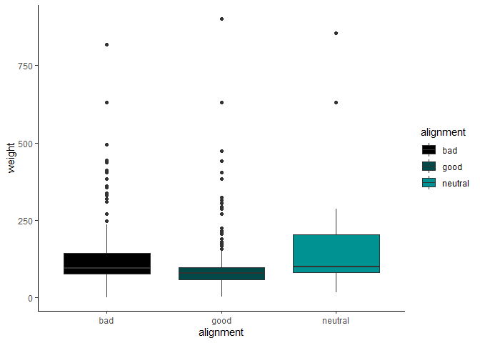
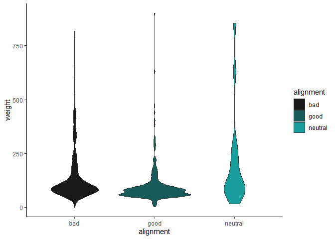
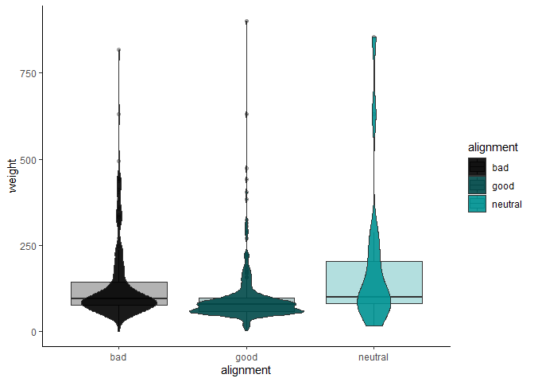
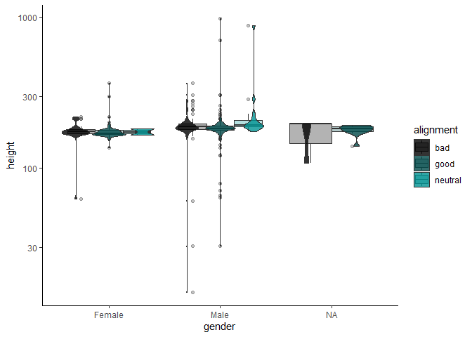
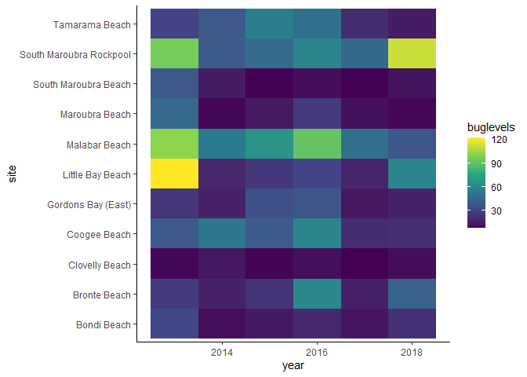
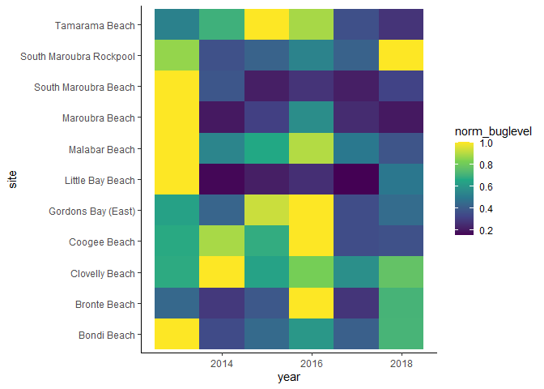

### Load the Libraries

```r
library(tidyverse)
```

```
## -- Attaching packages --------------------------------------- tidyverse 1.3.1 --
```

```
## v ggplot2 3.3.5     v purrr   0.3.4
## v tibble  3.1.6     v dplyr   1.0.8
## v tidyr   1.2.0     v stringr 1.4.0
## v readr   2.1.2     v forcats 0.5.1
```

```
## -- Conflicts ------------------------------------------ tidyverse_conflicts() --
## x dplyr::filter() masks stats::filter()
## x dplyr::lag()    masks stats::lag()
```

```r
library(janitor)
```

```
## 
## Attaching package: 'janitor'
```

```
## The following objects are masked from 'package:stats':
## 
##     chisq.test, fisher.test
```

```r
library("palmerpenguins")

#install.packages("ggVennDiagram")
library(ggVennDiagram)
library(RColorBrewer)

#install.packages("ggworldcloud")
library(ggwordcloud)


options(scipen=999) #cancels the use of scientific notation for the session
```

## Seting my color scheme (very important)

```r
library(paletteer)
colors <- paletteer::palettes_d_names
my_palette <- paletteer_d("colorBlindness::paletteMartin")
#I just think its funny this is called palette Martin
```


### Data

```r
superhero_info <- readr::read_csv("data/heroes_information.csv", na = c("", "-99", "-"))
```

```
## Rows: 734 Columns: 10
## -- Column specification --------------------------------------------------------
## Delimiter: ","
## chr (8): name, Gender, Eye color, Race, Hair color, Publisher, Skin color, A...
## dbl (2): Height, Weight
## 
## i Use `spec()` to retrieve the full column specification for this data.
## i Specify the column types or set `show_col_types = FALSE` to quiet this message.
```

```r
superhero_powers <- readr::read_csv("data/super_hero_powers.csv", na = c("", "-99", "-"))
```

```
## Rows: 667 Columns: 168
## -- Column specification --------------------------------------------------------
## Delimiter: ","
## chr   (1): hero_names
## lgl (167): Agility, Accelerated Healing, Lantern Power Ring, Dimensional Awa...
## 
## i Use `spec()` to retrieve the full column specification for this data.
## i Specify the column types or set `show_col_types = FALSE` to quiet this message.
```

```r
beachbugs_long <- readr::read_csv("data/beachbugs_long.csv")
```

```
## Rows: 66 Columns: 3
## -- Column specification --------------------------------------------------------
## Delimiter: ","
## chr (1): site
## dbl (2): year, buglevels
## 
## i Use `spec()` to retrieve the full column specification for this data.
## i Specify the column types or set `show_col_types = FALSE` to quiet this message.
```

### 1. 
Clean up the column names (no capitals, not spaces) of `superhero_info`, then use 2 functions to remind yourself of structure of the `superhero_info` data set.


```r
superhero_info <- janitor:: clean_names(superhero_info)
summary(superhero_info)
```

```
##      name              gender           eye_color             race          
##  Length:734         Length:734         Length:734         Length:734        
##  Class :character   Class :character   Class :character   Class :character  
##  Mode  :character   Mode  :character   Mode  :character   Mode  :character  
##                                                                             
##                                                                             
##                                                                             
##                                                                             
##   hair_color            height       publisher          skin_color       
##  Length:734         Min.   : 15.2   Length:734         Length:734        
##  Class :character   1st Qu.:173.0   Class :character   Class :character  
##  Mode  :character   Median :183.0   Mode  :character   Mode  :character  
##                     Mean   :186.7                                        
##                     3rd Qu.:191.0                                        
##                     Max.   :975.0                                        
##                     NA's   :217                                          
##   alignment             weight     
##  Length:734         Min.   :  2.0  
##  Class :character   1st Qu.: 61.0  
##  Mode  :character   Median : 81.0  
##                     Mean   :112.3  
##                     3rd Qu.:108.0  
##                     Max.   :900.0  
##                     NA's   :239
```

### 2.
Are bad guys bigger? Make box-plots of weight by `alignment` (alignment on the x-axis).

```r
superhero_info %>% 
  filter(alignment!="NA") %>% #I don't know if I should remove NA's but it makes the plot nicer so I'm going to
  ggplot(aes(x=alignment, y=weight, fill=alignment))+
  geom_boxplot()+
  scale_fill_manual(values = my_palette)+
  theme_classic()
```

```
## Warning: Removed 235 rows containing non-finite values (stat_boxplot).
```

<!-- -->

### 3. 
Now, make a violin plot of weight by `alignment` (alignment on the x-axis). Add some color!
  What information can you observe in the violin plot that was not visible in the boxplot?

```r
superhero_info %>% 
  filter(alignment!="NA") %>% 
  ggplot(aes(x=alignment, y=weight, fill=alignment))+
  geom_violin(alpha=0.9)+
  scale_fill_manual(values = my_palette)+
  theme_classic()
```

```
## Warning: Removed 235 rows containing non-finite values (stat_ydensity).
```

<!-- -->
We can see from this plot there are a lot of outliers!


### 4. 
Use `alpha = .5` in `geom_boxplot()` and `geom_violin()` to layer both plots on top of one another. What does this tell you about the distribution of weight in "`bad`" guys?

```r
superhero_info %>% 
  filter(alignment!="NA") %>% 
  ggplot(aes(x=alignment, y=weight, fill=alignment))+
  geom_boxplot(alpha=0.3)+
  geom_violin(alpha=0.9)+
  scale_fill_manual(values = my_palette)+
  theme_classic()
```

```
## Warning: Removed 235 rows containing non-finite values (stat_boxplot).
```

```
## Warning: Removed 235 rows containing non-finite values (stat_ydensity).
```

<!-- -->

### 5. 
Box plots are great for showing how the distribution of a numeric variable (e.g. weight) varies among a categorical variable (e.g. alignment).
  Make your own violin plot with the superhero data. 
  What is your numeric data? 
  What is your categorical variable?
  
I want to see how height differs between gender for the heroes... I also want to see if this is different by alignment...


```r
superhero_info %>% 
   filter(alignment!="NA") %>% 
   ggplot(aes(x=gender, y=height, fill=alignment))+
  geom_boxplot(position="dodge", alpha=0.3)+
  geom_violin(position="dodge", alpha=0.8)+
  scale_fill_manual(values=my_palette)+
  scale_y_log10()+
  theme_classic()
```

```
## Warning: Removed 215 rows containing non-finite values (stat_boxplot).
```

```
## Warning: Removed 215 rows containing non-finite values (stat_ydensity).
```

<!-- -->

```r
#I left the NA's in this time, except for in alignment because it was too busy with 3 bars for each graph
```

### 6. 
Remind yourself what `beachbugs` looks like. Then generate a heatmap of buglevels by site and year. 
color it with `scale_fill_gradient(low="yellow", high="red")` or colors of your choice. you may find it looks best with one color!
(dont forget, `coord_flip()` is a quick way to improve the look of your plot if you dont like the default orientation)


```r
summary(beachbugs_long)
```

```
##       year          site             buglevels      
##  Min.   :2013   Length:66          Min.   :  7.934  
##  1st Qu.:2014   Class :character   1st Qu.: 14.382  
##  Median :2016   Mode  :character   Median : 25.132  
##  Mean   :2016                      Mean   : 34.099  
##  3rd Qu.:2017                      3rd Qu.: 47.083  
##  Max.   :2018                      Max.   :121.534
```


```r
beachbugs_long %>% 
  ggplot(aes(site, year, fill=buglevels))+
  geom_tile()+
  scale_fill_viridis_c()+
  coord_flip()+
  theme_classic()
```

<!-- -->

```r
#I'm actually going to use this viridis package because its prettier and also color blind friendly
```

### 7.  
Use the provided code to normalize the beachbug data set. 
Then make a heatmap with the `beachbugs_normalized` data, and use the same color chois as above. Which heatmap do you think is more informative? why?


```r
#makes a new column of the highest buglevel observed at each site
beachbugs_w_max <- beachbugs_long %>% 
  group_by(site) %>% 
  mutate(max_buglevel = max(buglevels, na.rm=T)) %>% 
  arrange(site)
beachbugs_w_max
```

```
## # A tibble: 66 x 4
## # Groups:   site [11]
##     year site         buglevels max_buglevel
##    <dbl> <chr>            <dbl>        <dbl>
##  1  2013 Bondi Beach       32.2         32.2
##  2  2014 Bondi Beach       11.1         32.2
##  3  2015 Bondi Beach       14.3         32.2
##  4  2016 Bondi Beach       19.4         32.2
##  5  2017 Bondi Beach       13.2         32.2
##  6  2018 Bondi Beach       22.9         32.2
##  7  2013 Bronte Beach      26.8         61.3
##  8  2014 Bronte Beach      17.5         61.3
##  9  2015 Bronte Beach      23.6         61.3
## 10  2016 Bronte Beach      61.3         61.3
## # ... with 56 more rows
```

```r
#makes a new table where the buglevels are normalized to the max_buglevel
beachbugs_normalized <- beachbugs_w_max %>% 
  group_by(site) %>% 
  mutate(norm_buglevel = buglevels/max_buglevel) %>% 
  arrange(site,year) %>%
  select(site, year, norm_buglevel)   # you dont have to select(), but I think its a clearer looking table
beachbugs_normalized
```

```
## # A tibble: 66 x 3
## # Groups:   site [11]
##    site          year norm_buglevel
##    <chr>        <dbl>         <dbl>
##  1 Bondi Beach   2013         1    
##  2 Bondi Beach   2014         0.344
##  3 Bondi Beach   2015         0.445
##  4 Bondi Beach   2016         0.601
##  5 Bondi Beach   2017         0.409
##  6 Bondi Beach   2018         0.710
##  7 Bronte Beach  2013         0.436
##  8 Bronte Beach  2014         0.285
##  9 Bronte Beach  2015         0.385
## 10 Bronte Beach  2016         1    
## # ... with 56 more rows
```
 

```r
beachbugs_normalized %>% 
  ggplot(aes(site, year, fill=norm_buglevel))+
  geom_tile()+
  scale_fill_viridis_c()+
  coord_flip()+
  theme_classic()
```

<!-- -->

### 8.
Let's make a venn diagram of `superhero_info`, from 4 questions:
Is their alignment evil? 
Are their eyes red?
Are they male?
Are they bald?

Start by making the 4 vectors, then the list of vectors. The vector for alignment is provided:
### super heros venn

```r
# evil

evil_vec <- superhero_info %>%
  filter(alignment == "bad")%>%
  pull(name)

eye_vec <- superhero_info %>% 
  filter(eye_color=="red") %>% 
  pull(name)


male_vec <- superhero_info %>% 
  filter(gender=="Male")


bald_vec <- superhero_info
```

Your list of vectors will look something like this:

```r
# questions_list <- list(evil_vec, red_eye_vec, male_vec, bald_vec)
```

### 9. 
Let's make the venn diagram! use the code from lab as a reference. 

```r
# something like:
# ggVennDiagram( list, category.names = c("name", "name", "name", "name"))
```


### 10. Choose one intersection of the venn diagram that is interesting to you. Use dplyr to find the names of the superheros in that intersection. 


### 11. Make another venn diagram with the `superhero_info` data. What are your questions? ( At least 2!) 


### 12.
What are some very common super powers? Lets make a word cloud with the `superhero_powers` data.

Use the provided code to make the frequency table, then make a word cloud with it. 
Remember, you can change `scale_size_area(max_size = 20)` to a different number if the words wont fit!


```r
head(superhero_powers)
```

```
## # A tibble: 6 x 168
##   hero_names  Agility `Accelerated Healing` `Lantern Power Ri~` `Dimensional A~`
##   <chr>       <lgl>   <lgl>                 <lgl>               <lgl>           
## 1 3-D Man     TRUE    FALSE                 FALSE               FALSE           
## 2 A-Bomb      FALSE   TRUE                  FALSE               FALSE           
## 3 Abe Sapien  TRUE    TRUE                  FALSE               FALSE           
## 4 Abin Sur    FALSE   FALSE                 TRUE                FALSE           
## 5 Abomination FALSE   TRUE                  FALSE               FALSE           
## 6 Abraxas     FALSE   FALSE                 FALSE               TRUE            
## # ... with 163 more variables: `Cold Resistance` <lgl>, Durability <lgl>,
## #   Stealth <lgl>, `Energy Absorption` <lgl>, Flight <lgl>,
## #   `Danger Sense` <lgl>, `Underwater breathing` <lgl>, Marksmanship <lgl>,
## #   `Weapons Master` <lgl>, `Power Augmentation` <lgl>,
## #   `Animal Attributes` <lgl>, Longevity <lgl>, Intelligence <lgl>,
## #   `Super Strength` <lgl>, Cryokinesis <lgl>, Telepathy <lgl>,
## #   `Energy Armor` <lgl>, `Energy Blasts` <lgl>, Duplication <lgl>, ...
```

```r
power_frequency <- superhero_powers %>% 
  select(-hero_names) %>%
  summarise_all(~(sum(.))) %>%
  pivot_longer(everything(), names_to = "power", values_to = "freq")
power_frequency
```

```
## # A tibble: 167 x 2
##    power                  freq
##    <chr>                 <int>
##  1 Agility                 242
##  2 Accelerated Healing     178
##  3 Lantern Power Ring       11
##  4 Dimensional Awareness    25
##  5 Cold Resistance          47
##  6 Durability              257
##  7 Stealth                 126
##  8 Energy Absorption        77
##  9 Flight                  212
## 10 Danger Sense             30
## # ... with 157 more rows
```


### 13.  
Who are some very powerful supers? 
 Lets make a different word cloud with the `superhero_powers` data. 
Use the provided code to make the frequency table, then make a word cloud with it.
You can use `hero_names` for the labels, and `sum_powers` for size. 


```r
power_quantity <- superhero_powers %>% 
  pivot_longer(-hero_names, names_to = "power", values_to = "yes_or_no") %>% 
  group_by(hero_names) %>% 
  mutate(sum_powers = sum(yes_or_no, na.rm=T)) %>%
  arrange(desc(sum_powers), hero_names, desc(yes_or_no))
power_quantity
```

```
## # A tibble: 111,389 x 4
## # Groups:   hero_names [667]
##    hero_names power                 yes_or_no sum_powers
##    <chr>      <chr>                 <lgl>          <int>
##  1 Spectre    Agility               TRUE              49
##  2 Spectre    Accelerated Healing   TRUE              49
##  3 Spectre    Dimensional Awareness TRUE              49
##  4 Spectre    Stealth               TRUE              49
##  5 Spectre    Energy Absorption     TRUE              49
##  6 Spectre    Flight                TRUE              49
##  7 Spectre    Marksmanship          TRUE              49
##  8 Spectre    Longevity             TRUE              49
##  9 Spectre    Intelligence          TRUE              49
## 10 Spectre    Super Strength        TRUE              49
## # ... with 111,379 more rows
```

```r
#we have to trim down to only the top 50, or it will crowd the image!
power_quantity <- power_quantity %>% 
  ungroup %>%
  distinct(hero_names, sum_powers) %>%
  slice_max(sum_powers, n = 50)
power_quantity
```

```
## # A tibble: 51 x 2
##    hero_names        sum_powers
##    <chr>                  <int>
##  1 Spectre                   49
##  2 Amazo                     44
##  3 Living Tribunal           35
##  4 Martian Manhunter         35
##  5 Man of Miracles           34
##  6 Captain Marvel            33
##  7 T-X                       33
##  8 Galactus                  32
##  9 T-1000                    32
## 10 Mister Mxyzptlk           31
## # ... with 41 more rows
```


## That's it! 🎉
Thanks for coding with us all winter! 
Now go finish your group project :) 

