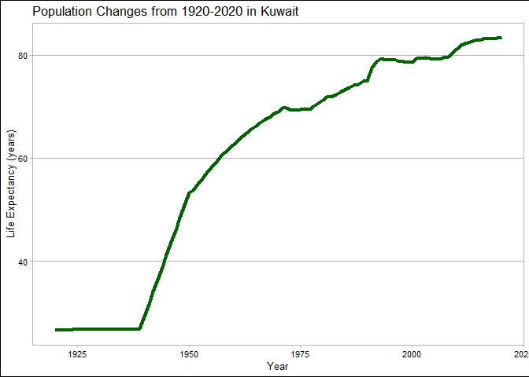
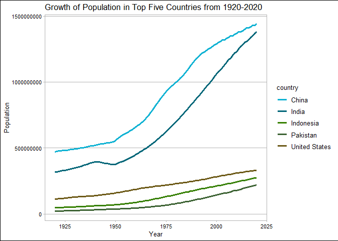
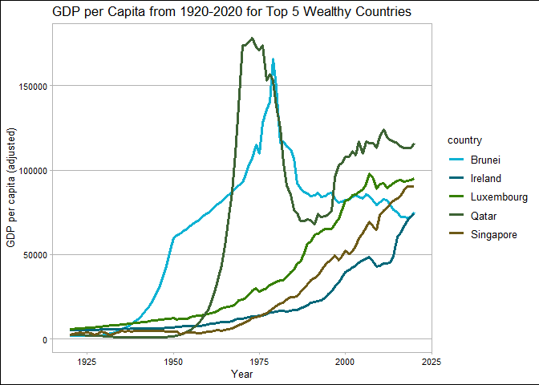
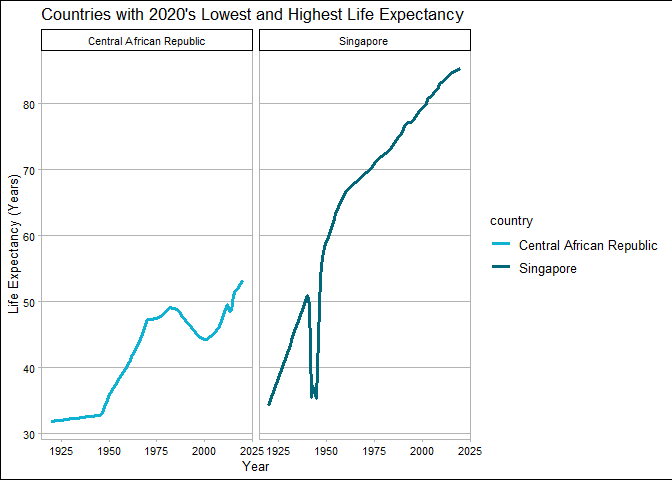
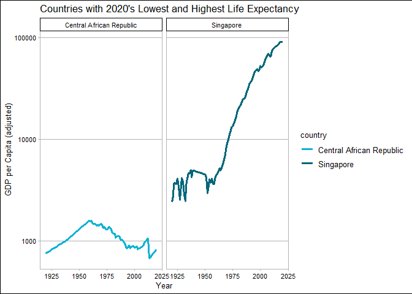
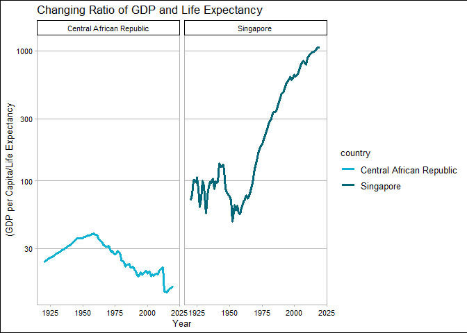

## Instructions
Answer the following questions and complete the exercises in RMarkdown. Please embed all of your code and push your final work to your repository. Your code should be organized, clean, and run free from errors. Be sure to **add your name** to the author header above. You may use any resources to answer these questions (including each other), but you may not post questions to Open Stacks or external help sites. There are 10 total questions.  

Make sure to use the formatting conventions of RMarkdown to make your report neat and clean! Your plots should use consistent aesthetics throughout.  

This exam is due by **12:00p on Tuesday, February 22**.  

Loading Libraries:

```r
library(tidyverse)
```

```
## -- Attaching packages --------------------------------------- tidyverse 1.3.1 --
```

```
## v ggplot2 3.3.5     v purrr   0.3.4
## v tibble  3.1.6     v dplyr   1.0.7
## v tidyr   1.1.4     v stringr 1.4.0
## v readr   2.1.1     v forcats 0.5.1
```

```
## -- Conflicts ------------------------------------------ tidyverse_conflicts() --
## x dplyr::filter() masks stats::filter()
## x dplyr::lag()    masks stats::lag()
```

```r
library(janitor)
```

```
## 
## Attaching package: 'janitor'
```

```
## The following objects are masked from 'package:stats':
## 
##     chisq.test, fisher.test
```

```r
library(here)
```

```
## here() starts at C:/Users/kemar/Documents/GitHub/BIS15W2022_KMartin
```

```r
library(naniar)
library(ggthemes)
library(RColorBrewer)
library(paletteer)
options(scipen=999) #cancels the use of scientific notation for the session
```


## Gapminder
For this assignment, we are going to use data from  [gapminder](https://www.gapminder.org/). Gapminder includes information about economics, population, social issues, and life expectancy from countries all over the world. We will use three data sets, so please load all three as separate objects.    


```r
poptotal <- readr::read_csv("data/population_total.csv")
```

```
## Rows: 195 Columns: 302
## -- Column specification --------------------------------------------------------
## Delimiter: ","
## chr   (1): country
## dbl (301): 1800, 1801, 1802, 1803, 1804, 1805, 1806, 1807, 1808, 1809, 1810,...
## 
## i Use `spec()` to retrieve the full column specification for this data.
## i Specify the column types or set `show_col_types = FALSE` to quiet this message.
```

```r
income_per_adjusted <- readr::read_csv("data/income_per_person_gdppercapita_ppp_inflation_adjusted.csv")
```

```
## Rows: 193 Columns: 242
## -- Column specification --------------------------------------------------------
## Delimiter: ","
## chr   (1): country
## dbl (241): 1800, 1801, 1802, 1803, 1804, 1805, 1806, 1807, 1808, 1809, 1810,...
## 
## i Use `spec()` to retrieve the full column specification for this data.
## i Specify the column types or set `show_col_types = FALSE` to quiet this message.
```

```r
life_exp <- readr::read_csv("data/life_expectancy_years.csv")
```

```
## Rows: 187 Columns: 302
## -- Column specification --------------------------------------------------------
## Delimiter: ","
## chr   (1): country
## dbl (301): 1800, 1801, 1802, 1803, 1804, 1805, 1806, 1807, 1808, 1809, 1810,...
## 
## i Use `spec()` to retrieve the full column specification for this data.
## i Specify the column types or set `show_col_types = FALSE` to quiet this message.
```

```r
#summary(poptotal) #untidy (also this is really long so I don't want the results to show up)
```


```r
#summary(income_per_adjusted) #untidy
```


```r
#summary(life_exp)#also untidy
```


1. (3 points) Once you have an idea of the structure of the data, please make each data set tidy (hint: think back to pivots) and store them as new objects. You will need both the original (wide) and tidy (long) data!  


```r
#pivot long for each data set
long_poptotal <- poptotal %>% 
  pivot_longer(-c(country),
               names_to="year",
               values_to="pop")
long_income_per_adjusted <- income_per_adjusted %>% 
  pivot_longer(-c(country),
               names_to = "year",
               values_to="gdpper")
long_life_exp <- life_exp %>% 
  pivot_longer(-c(country),
               names_to = "year",
               values_to = "lifeexp")
```


2. (1 point) How many different countries are represented in the data? Provide the total number and their names. Since each data set includes different numbers of countries, you will need to do this for each one.  


```r
#countries represented in population total data:
n_distinct(long_poptotal$country)
```

```
## [1] 195
```

```r
poptotal %>% 
  summarize(country)
```

```
## # A tibble: 195 x 1
##    country            
##    <chr>              
##  1 Afghanistan        
##  2 Albania            
##  3 Algeria            
##  4 Andorra            
##  5 Angola             
##  6 Antigua and Barbuda
##  7 Argentina          
##  8 Armenia            
##  9 Australia          
## 10 Austria            
## # ... with 185 more rows
```
-  The population data has 195 Countries represented

```r
#in the gdp per capita data:
n_distinct(long_income_per_adjusted$country)
```

```
## [1] 193
```

```r
income_per_adjusted %>% 
  summarize(country)
```

```
## # A tibble: 193 x 1
##    country            
##    <chr>              
##  1 Afghanistan        
##  2 Albania            
##  3 Algeria            
##  4 Andorra            
##  5 Angola             
##  6 Antigua and Barbuda
##  7 Argentina          
##  8 Armenia            
##  9 Australia          
## 10 Austria            
## # ... with 183 more rows
```
-  THe GDP per capita data has 193 countries represented


```r
#and in the life expectancy data:
n_distinct(long_life_exp$country)
```

```
## [1] 187
```

```r
life_exp %>% 
  summarize(country)
```

```
## # A tibble: 187 x 1
##    country            
##    <chr>              
##  1 Afghanistan        
##  2 Albania            
##  3 Algeria            
##  4 Andorra            
##  5 Angola             
##  6 Antigua and Barbuda
##  7 Argentina          
##  8 Armenia            
##  9 Australia          
## 10 Austria            
## # ... with 177 more rows
```
- The life expectancy data has 187 countries represented

## Life Expectancy  

3. (2 points) Let's limit the data to 100 years (1920-2020). For these years, which country has the highest average life expectancy? How about the lowest average life expectancy? 


```r
#limiting the data to the years I want for the life expectancy
#changing the years to numerics (they are currently characters??) -this wasn't actually my problem but I just left it
long_life_exp <-  
  long_life_exp %>% 
   mutate(numeric_year=as.numeric(long_life_exp$year)) %>% 
  filter(numeric_year>=1920, numeric_year<=2020)
```


```r
#group by, and summarize:
long_life_exp %>% 
  group_by(country) %>% 
  summarize(avg_life_expectancy=mean(lifeexp, na.rm=T)) %>% 
  arrange(avg_life_expectancy) %>% 
  head(n=1)
```

```
## # A tibble: 1 x 2
##   country                  avg_life_expectancy
##   <chr>                                  <dbl>
## 1 Central African Republic                41.8
```

- Central African Repblic has the lowest average life expectancy from 1920-2020


```r
long_life_exp %>% 
  group_by(country) %>% 
  summarize(avg_life_expectancy=mean(lifeexp, na.rm=T)) %>% 
  arrange(desc(avg_life_expectancy)) %>% 
  head(n=1)
```

```
## # A tibble: 1 x 2
##   country avg_life_expectancy
##   <chr>                 <dbl>
## 1 Andorra                79.8
```
- Andorra had the highest average life expectancy for 1920-2020

4. (3 points) Although we can see which country has the highest life expectancy for the past 100 years, we don't know which countries have changed the most. What are the top 5 countries that have experienced the biggest improvement in life expectancy between 1920-2020?  


```r
#need to mutate- add a column that calculates the difference between 1920 and 2020
#Can't use long data for this- using original wide data
life_exp %>% 
  select(country, `1920`:`2020`) %>% 
  mutate(lifeexp_improvement=`2020`-`1920`) %>% 
  summarize(country, lifeexp_improvement) %>% 
  arrange(desc(lifeexp_improvement)) %>% 
  head(n=1)
```

```
## # A tibble: 1 x 2
##   country lifeexp_improvement
##   <chr>                 <dbl>
## 1 Kuwait                 56.8
```


5. (3 points) Make a plot that shows the change over the past 100 years for the country with the biggest improvement in life expectancy. Be sure to add appropriate aesthetics to make the plot clean and clear. Once you have made the plot, do a little internet searching and see if you can discover what historical event may have contributed to this remarkable change.  

```r
#my color scheme!
my_palette <- paletteer_d("calecopal::kelp2")
```


```r
#I need to refine the life expectancy data to Kuwait and summarize

kuwait_pop <- long_life_exp %>% 
  filter(country=="Kuwait")
```


```r
kuwait_pop %>% 
  ggplot(aes(x=numeric_year, y=lifeexp))+
  geom_line(size=1.5, color="darkgreen")+
  theme_calc()+
  labs(title="Population Changes from 1920-2020 in Kuwait",
       x="Year",
       y="Life Expectancy (years)")
```

<!-- -->
- the discovery of oil in Kuwait contributed to this sharp increase in life expectancy


## Population Growth
6. (3 points) Which 5 countries have had the highest population growth over the past 100 years (1920-2020)?  


```r
#Using my wide data to find the change in population between 1920 and 2020
poptotal %>% 
  mutate(pop_change=`2020`-`1920`) %>% 
  arrange(desc(pop_change)) %>% 
  summarize(country, pop_change) %>% 
  head(n=5)
```

```
## # A tibble: 5 x 2
##   country       pop_change
##   <chr>              <dbl>
## 1 India         1063000000
## 2 China          968000000
## 3 Indonesia      226700000
## 4 United States  220000000
## 5 Pakistan       199300000
```


7. (4 points) Produce a plot that shows the 5 countries that have had the highest population growth over the past 100 years (1920-2020). Which countries appear to have had exponential growth?  


```r
#first I have to restrict the long data to 1920-2020
long_poptotal <- long_poptotal %>% 
   mutate(numeric_year=as.numeric(long_poptotal$year)) %>% 
  filter(numeric_year>=1920, numeric_year<=2020)
```


```r
#now its time to plot
long_poptotal %>% 
  filter(country=="India"|country=="China"|country=="Indonesia"|country=="United States"|country=="Pakistan") %>% 
  ggplot(aes(x=numeric_year, color=country, y=pop, fill=country))+
  geom_line(size=1.25)+
   scale_color_manual(values=my_palette)+
  labs(title="Growth of Population in Top Five Countries from 1920-2020",
       x="Year",
       y="Population")+
  theme_calc()
```

<!-- -->
- China and India seem to have experienced exponential growth

## Income
The units used for income are gross domestic product per person adjusted for differences in purchasing power in international dollars.

8. (4 points) As in the previous questions, which countries have experienced the biggest growth in per person GDP. Show this as a table and then plot the changes for the top 5 countries. With a bit of research, you should be able to explain the dramatic downturns of the wealthiest economies that occurred during the 1980's.  


```r
#using the wide form of data to find the growth in GDP
income_per_adjusted <- income_per_adjusted %>% 
  mutate(change_gdp_100=`2020`-`1920`)
  
income_per_adjusted %>% 
  summarize(country, change_gdp_100) %>% 
  arrange(desc(change_gdp_100)) %>% 
  head(n=5)
```

```
## # A tibble: 5 x 2
##   country    change_gdp_100
##   <chr>               <dbl>
## 1 Qatar              113700
## 2 Luxembourg          89370
## 3 Singapore           88060
## 4 Brunei              72970
## 5 Ireland             68930
```


```r
#now using the long form to PLOT
#First changing the years to numerics, and restricting to 1920-2020
long_income_per_adjusted <- long_income_per_adjusted %>% 
   mutate(numeric_year=as.numeric(long_income_per_adjusted$year)) %>% 
  filter(numeric_year>=1920, numeric_year<=2020)
```


```r
#now to refine the data to top 5 countries and PLOT
long_income_per_adjusted %>% 
  filter(country=="Qatar"|country=="Luxembourg"|country=="Singapore"|country=="Brunei"|country=="Ireland") %>% 
    ggplot(aes(x=numeric_year, color=country, y=gdpper, fill=country))+
  geom_line(size=1.25)+
   scale_color_manual(values=my_palette)+
  labs(title= "GDP per Capita from 1920-2020 for Top 5 Wealthy Countries",
       x="Year",
       y="GDP per capita (adjusted)")+
  theme_calc()
```

<!-- -->
-  The drop in the 1980's in Brunei and Qatar is likely due to the 1980's oil glut, when oil production exceeded demands and dropped in price.
-  [1980's Oil Glut Wikipedia](https://en.wikipedia.org/wiki/1980s_oil_glut#:~:text=The%20world%20price%20of%20oil,to%20%2424%20in%202020%20dollars).)

9. (3 points) Create three new objects that restrict each data set (life expectancy, population, income) to the years 1920-2020. Hint: I suggest doing this with the long form of your data. Once this is done, merge all three data sets using the code I provide below. You may need to adjust the code depending on how you have named your objects. I called mine `life_expectancy_100`, `population_100`, and `income_100`. For some of you, learning these `joins` will be important for your project.  


```r
gapminder_join <- inner_join(long_life_exp, long_poptotal, by= c("country", "year"))
gapminder_join <- inner_join(gapminder_join, long_income_per_adjusted, by= c("country", "year"))
gapminder_join
```

```
## # A tibble: 18,887 x 8
##    country     year  lifeexp numeric_year.x      pop numeric_year.y gdpper
##    <chr>       <chr>   <dbl>          <dbl>    <dbl>          <dbl>  <dbl>
##  1 Afghanistan 1920     30.6           1920 10600000           1920   1490
##  2 Afghanistan 1921     30.7           1921 10500000           1921   1520
##  3 Afghanistan 1922     30.8           1922 10300000           1922   1550
##  4 Afghanistan 1923     30.8           1923  9710000           1923   1570
##  5 Afghanistan 1924     30.9           1924  9200000           1924   1600
##  6 Afghanistan 1925     31             1925  8720000           1925   1630
##  7 Afghanistan 1926     31             1926  8260000           1926   1650
##  8 Afghanistan 1927     31.1           1927  7830000           1927   1680
##  9 Afghanistan 1928     31.1           1928  7420000           1928   1710
## 10 Afghanistan 1929     31.2           1929  7100000           1929   1740
## # ... with 18,877 more rows, and 1 more variable: numeric_year <dbl>
```

10. (4 points) Use the joined data to perform an analysis of your choice. The analysis should include a comparison between two or more of the variables `life_expectancy`, `population`, or `income.`  

- I want to look at the differences year by year between income and life expectancy for the country with the highest and lowest life expectancy in 2020
    -  Using faceting

```r
#first step is finding the countries with the highest and lowest life expectancy in 2020
gapminder_join %>% 
  filter(year=="2020") %>% 
  arrange(desc(lifeexp)) %>% 
  head(n=1)
```

```
## # A tibble: 1 x 8
##   country year  lifeexp numeric_year.x    pop numeric_year.y gdpper numeric_year
##   <chr>   <chr>   <dbl>          <dbl>  <dbl>          <dbl>  <dbl>        <dbl>
## 1 Singap~ 2020     85.3           2020 5.85e6           2020  90500         2020
```
-  Singapore has the highest life expectancy in 2020


```r
#now the lowest:
gapminder_join %>% 
  filter(year=="2020") %>% 
  arrange(lifeexp) %>% 
  head(n=1)
```

```
## # A tibble: 1 x 8
##   country year  lifeexp numeric_year.x    pop numeric_year.y gdpper numeric_year
##   <chr>   <chr>   <dbl>          <dbl>  <dbl>          <dbl>  <dbl>        <dbl>
## 1 Centra~ 2020     53.3           2020 4.83e6           2020    817         2020
```
-The Central African Republic has the lowest life expectancy for 2020


```r
#now I want to create side by side graphs of life expectancy
gapminder_join %>% 
  filter(country=="Central African Republic"| country== "Singapore") %>% 
  ggplot(aes(x=numeric_year.x, y=lifeexp, color=country))+
  geom_line(size=1.25)+
  scale_color_manual(values=my_palette)+
  facet_wrap(country~.)+
  theme_calc()+
  labs(title= "Countries with 2020's Lowest and Highest Life Expectancy",
       x="Year",
       y="Life Expectancy (Years)")
```

<!-- -->

- From this graph we can see that Central African Republic has the same life expectancy as Singapore did about 50 years ago
-  We also see a very large drop in life expectancy around the 1940's in Singapore; This is likely due to WW2 and the Japanese occupancy of Singapore.


```r
#Now I want to look at income:
gapminder_join %>% 
  filter(country=="Central African Republic"| country== "Singapore") %>% 
  ggplot(aes(x=numeric_year.x, y=gdpper, color=country))+
  geom_line(size=1.25)+
  scale_color_manual(values=my_palette)+
  facet_wrap(country~.)+
  scale_y_log10()+
    theme_calc()+
  labs(title= "Countries with 2020's Lowest and Highest Life Expectancy",
       x="Year",
       y="GDP per Capita (adjusted)")
```

<!-- -->
- Important to note on this is that the income levels were so different that I had to use a log scale for this (this says a lot in itself about the relation between money and life expectancy)

- Here we can also see that though income per person has not improved since around the 1960's for the Central African Republic, we know from the previous graph that life expectancy has continued to climb

- This makes me want to see how the relationship between GDP and life expectancy changes over time for the two countries:


```r
#To see the relationship, I am going to mutate column to show a ratio (GDP per capita/life expectancy)
#This should show us something similar to how much money it costs to add a year of life over
gap_lifemoney <- gapminder_join %>% 
 mutate(life_money=gdpper/lifeexp) 

gap_lifemoney %>% 
  filter(country=="Central African Republic"| country== "Singapore") %>% 
  ggplot(aes(x=numeric_year.x, y=life_money, color=country))+
  geom_line(size=1.25)+
  scale_color_manual(values=my_palette)+
  facet_wrap(country~.)+
  scale_y_log10()+
  theme_calc()+
  labs(title= "Changing Ratio of GDP and Life Expectancy",
       x="Year",
       y="(GDP per Capita/Life Expectancy")
```

<!-- -->

-  This graph is somewhat hard to interpret but some interesting things about it include:
    -  The ratio of GDP/Life expectancy starts to show a downward trend after about 1960 for Central African Republic. It is difficult to speculate about why this is, but I think it could be due to humanitarian efforts to help improve living conditions and access to necessities like health care. This could lead to no increase in GDP per capita but longer lifespans.
    -  The ratio is starting to increase at a lower rate in the more recent years in Singapore. We could interpret this as a sign that money can only extend life expectancy to a certain point. (Or it could be a side effect of the log scale)


