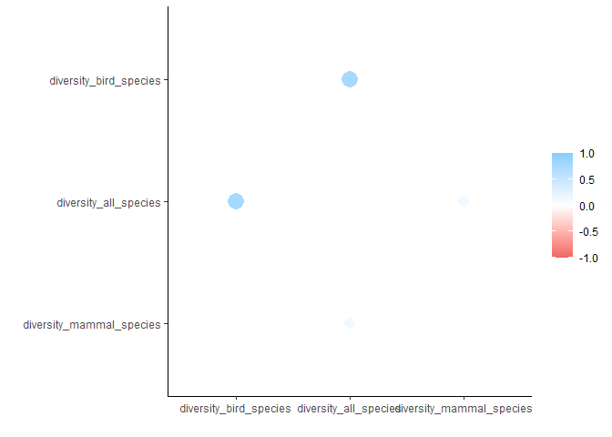

## Instructions
Answer the following questions and complete the exercises in RMarkdown. Please embed all of your code and push your final work to your repository. Your code should be organized, clean, and run free from errors. Remember, you must remove the `#` for any included code chunks to run. Be sure to add your name to the author header above. You may use any resources to answer these questions (including each other), but you may not post questions to Open Stacks or external help sites. There are 15 total questions, each is worth 2 points.  

Make sure to use the formatting conventions of RMarkdown to make your report neat and clean!  

This exam is due by 12:00p on Thursday, January 27.  

## Load the tidyverse
If you plan to use any other libraries to complete this assignment then you should load them here.

```r
library(tidyverse)
```

```
## -- Attaching packages --------------------------------------- tidyverse 1.3.1 --
```

```
## v ggplot2 3.3.5     v purrr   0.3.4
## v tibble  3.1.6     v dplyr   1.0.7
## v tidyr   1.1.4     v stringr 1.4.0
## v readr   2.1.1     v forcats 0.5.1
```

```
## -- Conflicts ------------------------------------------ tidyverse_conflicts() --
## x dplyr::filter() masks stats::filter()
## x dplyr::lag()    masks stats::lag()
```

```r
library(janitor)
```

```
## 
## Attaching package: 'janitor'
```

```
## The following objects are masked from 'package:stats':
## 
##     chisq.test, fisher.test
```

```r
library(naniar)
```

## Questions  
Wikipedia's definition of [data science](https://en.wikipedia.org/wiki/Data_science): "Data science is an interdisciplinary field that uses scientific methods, processes, algorithms and systems to extract knowledge and insights from noisy, structured and unstructured data, and apply knowledge and actionable insights from data across a broad range of application domains."  

1. (2 points) Consider the definition of data science above. Although we are only part-way through the quarter, what specific elements of data science do you feel we have practiced? Provide at least one specific example.  

We have done quite a lot of the "extracting knowledge and insights" portion of this, as we have practiced performing various statistical analyses on the data, such as mean, and putting information into more easily readable data frames and tables.

We have also practiced refining data and organizing it into a usable format- using `select` and `filter` to specify what subsets within the data we want to analyze

2. (2 points) What is the most helpful or interesting thing you have learned so far in BIS 15L? What is something that you think needs more work or practice? 

I think the most useful thing that I have learned from BIS15L so far is the ability to `group by` and `summarize` since there are so many applications I can think of for this pair of functions, and so many statistical analyses I could do on large amounts of data.

Something I think I need more practice with is changing classes of data, the way I do it currently works if I only have a few variables to change, but I think there is probably a more efficient way to do it.

In the midterm 1 folder there is a second folder called `data`. Inside the `data` folder, there is a .csv file called `ElephantsMF`. These data are from Phyllis Lee, Stirling University, and are related to Lee, P., et al. (2013), "Enduring consequences of early experiences: 40-year effects on survival and success among African elephants (Loxodonta africana)," Biology Letters, 9: 20130011. [kaggle](https://www.kaggle.com/mostafaelseidy/elephantsmf).  

3. (2 points) Please load these data as a new object called `elephants`. Use the function(s) of your choice to get an idea of the structure of the data. Be sure to show the class of each variable.


```r
elephants <- readr:: read_csv("data/ElephantsMF.csv")
```

```
## Rows: 288 Columns: 3
```

```
## -- Column specification --------------------------------------------------------
## Delimiter: ","
## chr (1): Sex
## dbl (2): Age, Height
```

```
## 
## i Use `spec()` to retrieve the full column specification for this data.
## i Specify the column types or set `show_col_types = FALSE` to quiet this message.
```

```r
summary(elephants)
```

```
##       Age            Height           Sex           
##  Min.   : 0.01   Min.   : 75.46   Length:288        
##  1st Qu.: 4.58   1st Qu.:160.75   Class :character  
##  Median : 9.46   Median :200.00   Mode  :character  
##  Mean   :10.97   Mean   :187.68                     
##  3rd Qu.:16.50   3rd Qu.:221.09                     
##  Max.   :32.17   Max.   :304.06
```

```r
any_na(elephants)
```

```
## [1] FALSE
```


4. (2 points) Change the names of the variables to lower case and change the class of the variable `sex` to a factor.


```r
names(elephants)
```

```
## [1] "Age"    "Height" "Sex"
```

```r
elephants <- clean_names(elephants)
```


```r
elephants$sex <- as.factor(elephants$sex)
levels(elephants$sex)
```

```
## [1] "F" "M"
```


5. (2 points) How many male and female elephants are represented in the data?


```r
elephants %>% count(sex)
```

```
## # A tibble: 2 x 2
##   sex       n
##   <fct> <int>
## 1 F       150
## 2 M       138
```


6. (2 points) What is the average age all elephants in the data?

```r
mean(elephants$age)
```

```
## [1] 10.97132
```
The average age for all the elephants is about 11 years

7. (2 points) How does the average age and height of elephants compare by sex?

```r
elephants %>% 
  group_by(sex) %>% 
  summarize(average_age=mean(age), average_height=(mean(height)))
```

```
## # A tibble: 2 x 3
##   sex   average_age average_height
##   <fct>       <dbl>          <dbl>
## 1 F           12.8            190.
## 2 M            8.95           185.
```


8. (2 points) How does the average height of elephants compare by sex for individuals over 20 years old. Include the min and max height as well as the number of individuals in the sample as part of your analysis.  


```r
elephants %>% 
  filter(age>=20) %>% 
  group_by(sex) %>% 
  summarize(average_age=mean(age), average_height=mean(height), min_height=min(height), max_height=max(height), n=n())
```

```
## # A tibble: 2 x 6
##   sex   average_age average_height min_height max_height     n
##   <fct>       <dbl>          <dbl>      <dbl>      <dbl> <int>
## 1 F            25.6           232.       193.       278.    37
## 2 M            25.2           270.       229.       304.    13
```


For the next series of questions, we will use data from a study on vertebrate community composition and impacts from defaunation in [Gabon, Africa](https://en.wikipedia.org/wiki/Gabon). One thing to notice is that the data include 24 separate transects. Each transect represents a path through different forest management areas.  

Reference: Koerner SE, Poulsen JR, Blanchard EJ, Okouyi J, Clark CJ. Vertebrate community composition and diversity declines along a defaunation gradient radiating from rural villages in Gabon. _Journal of Applied Ecology_. 2016. This paper, along with a description of the variables is included inside the midterm 1 folder.  

9. (2 points) Load `IvindoData_DryadVersion.csv` and use the function(s) of your choice to get an idea of the overall structure. Change the variables `HuntCat` and `LandUse` to factors.


```r
ivindo <- readr::read_csv("data/IvindoData_DryadVersion.csv")
```

```
## Rows: 24 Columns: 26
```

```
## -- Column specification --------------------------------------------------------
## Delimiter: ","
## chr  (2): HuntCat, LandUse
## dbl (24): TransectID, Distance, NumHouseholds, Veg_Rich, Veg_Stems, Veg_lian...
```

```
## 
## i Use `spec()` to retrieve the full column specification for this data.
## i Specify the column types or set `show_col_types = FALSE` to quiet this message.
```


```r
summary(ivindo)
```

```
##    TransectID       Distance        HuntCat          NumHouseholds  
##  Min.   : 1.00   Min.   : 2.700   Length:24          Min.   :13.00  
##  1st Qu.: 5.75   1st Qu.: 5.668   Class :character   1st Qu.:24.75  
##  Median :14.50   Median : 9.720   Mode  :character   Median :29.00  
##  Mean   :13.50   Mean   :11.879                      Mean   :37.88  
##  3rd Qu.:20.25   3rd Qu.:17.683                      3rd Qu.:54.00  
##  Max.   :27.00   Max.   :26.760                      Max.   :73.00  
##    LandUse             Veg_Rich       Veg_Stems       Veg_liana     
##  Length:24          Min.   :10.88   Min.   :23.44   Min.   : 4.750  
##  Class :character   1st Qu.:13.10   1st Qu.:28.69   1st Qu.: 9.033  
##  Mode  :character   Median :14.94   Median :32.45   Median :11.940  
##                     Mean   :14.83   Mean   :32.80   Mean   :11.040  
##                     3rd Qu.:16.54   3rd Qu.:37.08   3rd Qu.:13.250  
##                     Max.   :18.75   Max.   :47.56   Max.   :16.380  
##     Veg_DBH        Veg_Canopy    Veg_Understory     RA_Apes      
##  Min.   :28.45   Min.   :2.500   Min.   :2.380   Min.   : 0.000  
##  1st Qu.:40.65   1st Qu.:3.250   1st Qu.:2.875   1st Qu.: 0.000  
##  Median :43.90   Median :3.430   Median :3.000   Median : 0.485  
##  Mean   :46.09   Mean   :3.469   Mean   :3.020   Mean   : 2.045  
##  3rd Qu.:50.58   3rd Qu.:3.750   3rd Qu.:3.167   3rd Qu.: 3.815  
##  Max.   :76.48   Max.   :4.000   Max.   :3.880   Max.   :12.930  
##     RA_Birds      RA_Elephant       RA_Monkeys      RA_Rodent    
##  Min.   :31.56   Min.   :0.0000   Min.   : 5.84   Min.   :1.060  
##  1st Qu.:52.51   1st Qu.:0.0000   1st Qu.:22.70   1st Qu.:2.047  
##  Median :57.90   Median :0.3600   Median :31.74   Median :3.230  
##  Mean   :58.64   Mean   :0.5450   Mean   :31.30   Mean   :3.278  
##  3rd Qu.:68.17   3rd Qu.:0.8925   3rd Qu.:39.88   3rd Qu.:4.093  
##  Max.   :85.03   Max.   :2.3000   Max.   :54.12   Max.   :6.310  
##   RA_Ungulate     Rich_AllSpecies Evenness_AllSpecies Diversity_AllSpecies
##  Min.   : 0.000   Min.   :15.00   Min.   :0.6680      Min.   :1.966       
##  1st Qu.: 1.232   1st Qu.:19.00   1st Qu.:0.7542      1st Qu.:2.248       
##  Median : 2.545   Median :20.00   Median :0.7760      Median :2.316       
##  Mean   : 4.166   Mean   :20.21   Mean   :0.7699      Mean   :2.310       
##  3rd Qu.: 5.157   3rd Qu.:22.00   3rd Qu.:0.8083      3rd Qu.:2.429       
##  Max.   :13.860   Max.   :24.00   Max.   :0.8330      Max.   :2.566       
##  Rich_BirdSpecies Evenness_BirdSpecies Diversity_BirdSpecies Rich_MammalSpecies
##  Min.   : 8.00    Min.   :0.5590       Min.   :1.162         Min.   : 6.000    
##  1st Qu.:10.00    1st Qu.:0.6825       1st Qu.:1.603         1st Qu.: 9.000    
##  Median :11.00    Median :0.7220       Median :1.680         Median :10.000    
##  Mean   :10.33    Mean   :0.7137       Mean   :1.661         Mean   : 9.875    
##  3rd Qu.:11.00    3rd Qu.:0.7722       3rd Qu.:1.784         3rd Qu.:11.000    
##  Max.   :13.00    Max.   :0.8240       Max.   :2.008         Max.   :12.000    
##  Evenness_MammalSpecies Diversity_MammalSpecies
##  Min.   :0.6190         Min.   :1.378          
##  1st Qu.:0.7073         1st Qu.:1.567          
##  Median :0.7390         Median :1.699          
##  Mean   :0.7477         Mean   :1.698          
##  3rd Qu.:0.7847         3rd Qu.:1.815          
##  Max.   :0.8610         Max.   :2.065
```

```r
any_na(ivindo)
```

```
## [1] FALSE
```


```r
ivindo <- clean_names(ivindo)
names(ivindo)
```

```
##  [1] "transect_id"              "distance"                
##  [3] "hunt_cat"                 "num_households"          
##  [5] "land_use"                 "veg_rich"                
##  [7] "veg_stems"                "veg_liana"               
##  [9] "veg_dbh"                  "veg_canopy"              
## [11] "veg_understory"           "ra_apes"                 
## [13] "ra_birds"                 "ra_elephant"             
## [15] "ra_monkeys"               "ra_rodent"               
## [17] "ra_ungulate"              "rich_all_species"        
## [19] "evenness_all_species"     "diversity_all_species"   
## [21] "rich_bird_species"        "evenness_bird_species"   
## [23] "diversity_bird_species"   "rich_mammal_species"     
## [25] "evenness_mammal_species"  "diversity_mammal_species"
```

```r
ivindo$hunt_cat <- as.factor(ivindo$hunt_cat)
ivindo$land_use <- as.factor(ivindo$land_use)
```


```r
class(ivindo$hunt_cat)
```

```
## [1] "factor"
```

```r
class(ivindo$land_use)
```

```
## [1] "factor"
```


10. (4 points) For the transects with high and moderate hunting intensity, how does the average diversity of birds and mammals compare?


```r
ivindo %>% 
  filter(hunt_cat=="High" | hunt_cat=="Moderate") %>% 
  group_by(hunt_cat) %>%
  summarize(avg_diversity_birds=mean(diversity_bird_species), avg_diversity_mammals=mean(diversity_mammal_species), total=n())
```

```
## # A tibble: 2 x 4
##   hunt_cat avg_diversity_birds avg_diversity_mammals total
##   <fct>                  <dbl>                 <dbl> <int>
## 1 High                    1.66                  1.74     7
## 2 Moderate                1.62                  1.68     8
```


11. (4 points) One of the conclusions in the study is that the relative abundance of animals drops off the closer you get to a village. Let's try to reconstruct this (without the statistics). How does the relative abundance (RA) of apes, birds, elephants, monkeys, rodents, and ungulates compare between sites that are less than 3km from a village to sites that are greater than 25km from a village? The variable `Distance` measures the distance of the transect from the nearest village. Hint: try using the `across` operator.  


```r
filter(ivindo, distance<="3") %>% 
  summarize(across(contains("ra_"), mean))
```

```
## # A tibble: 1 x 6
##   ra_apes ra_birds ra_elephant ra_monkeys ra_rodent ra_ungulate
##     <dbl>    <dbl>       <dbl>      <dbl>     <dbl>       <dbl>
## 1    2.91     53.1       0.589       34.4      2.87        6.18
```


```r
filter(ivindo, distance>="25")%>%
  summarize(across(contains("ra_"), mean))
```

```
## # A tibble: 1 x 6
##   ra_apes ra_birds ra_elephant ra_monkeys ra_rodent ra_ungulate
##     <dbl>    <dbl>       <dbl>      <dbl>     <dbl>       <dbl>
## 1    1.21     63.2        0.44       29.5      3.62        1.96
```
There is actually a higher RA for Apes, Elephants, Monkeys, and Ungulates at the transects less than 3km from the villages. However, the RA of rodents and birds increasd in the transects further from a village.

12. (4 points) Based on your interest, do one exploratory analysis on the `gabon` data of your choice. This analysis needs to include a minimum of two functions in `dplyr.`

I'm interested in looking at the diversity of other species compared to the diversity of birds a little bit more in depth, since birds are supposed to be good indicators of ecosystem health I wanted to get a better picture of how accurately we could predict species diversity using just bird data.

This is a correlation measure so I'm going to use a package called `corrr` that I found

```r
#install.packages("corrr")
library(corrr)
```


```r
bird_correlation<- ivindo %>% 
  select(diversity_bird_species, diversity_all_species, diversity_mammal_species) %>% 
  correlate()
```

```
## 
## Correlation method: 'pearson'
## Missing treated using: 'pairwise.complete.obs'
```

```r
bird_correlation
```

```
## # A tibble: 3 x 4
##   term                     diversity_bird_s~ diversity_all_sp~ diversity_mammal~
##   <chr>                                <dbl>             <dbl>             <dbl>
## 1 diversity_bird_species              NA                 0.775             0.142
## 2 diversity_all_species                0.775            NA                 0.337
## 3 diversity_mammal_species             0.142             0.337            NA
```


```r
rplot(bird_correlation)
```

```
## Don't know how to automatically pick scale for object of type noquote. Defaulting to continuous.
```

<!-- -->

Using the plots and the correlation given, we can see that the bird species diversity is somewhat positively correlated with total species diversity, also mammal diversity to a lower extent.

I wondered if this is still true in land areas used for logging, so I can restrict the data for land use and see if the correlation increases or decreases:

```r
landuse_bird_correlation <-ivindo %>% 
  filter(land_use=="Logging") %>% 
           select(diversity_bird_species, diversity_all_species, diversity_mammal_species) %>%
           correlate()
```

```
## 
## Correlation method: 'pearson'
## Missing treated using: 'pairwise.complete.obs'
```

```r
landuse_bird_correlation
```

```
## # A tibble: 3 x 4
##   term                     diversity_bird_s~ diversity_all_sp~ diversity_mammal~
##   <chr>                                <dbl>             <dbl>             <dbl>
## 1 diversity_bird_species             NA                  0.693           -0.0109
## 2 diversity_all_species               0.693             NA                0.199 
## 3 diversity_mammal_species           -0.0109             0.199           NA
```

It decreased a bit for correlation with all species, and a lot for diversity of mammal species. We can't really learn anything from this because correlation =/= causation but this was a fun exercise anyway.
